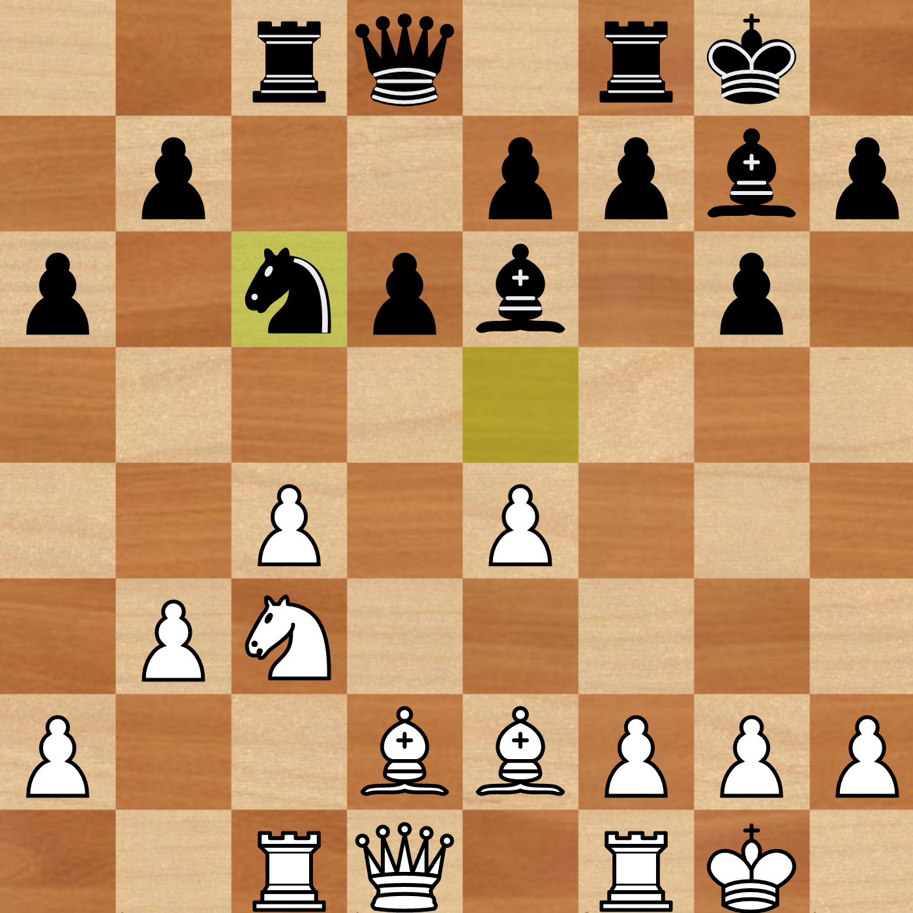
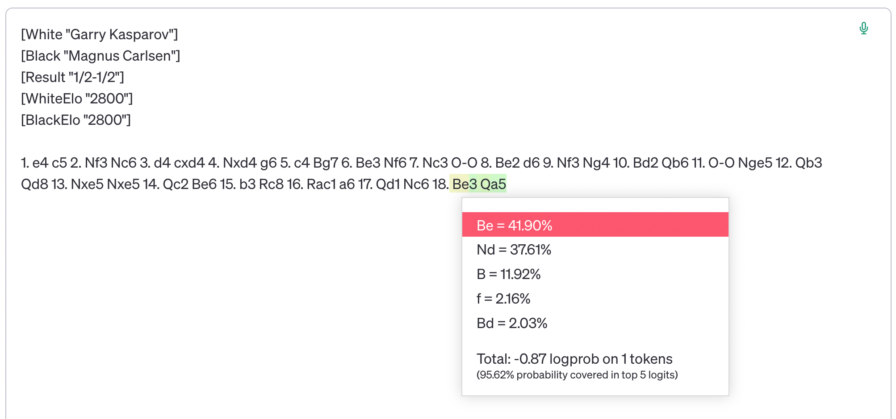
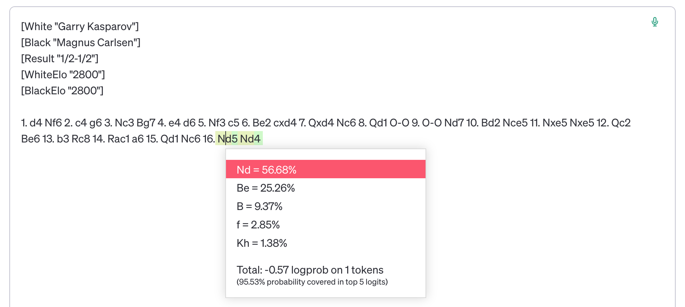
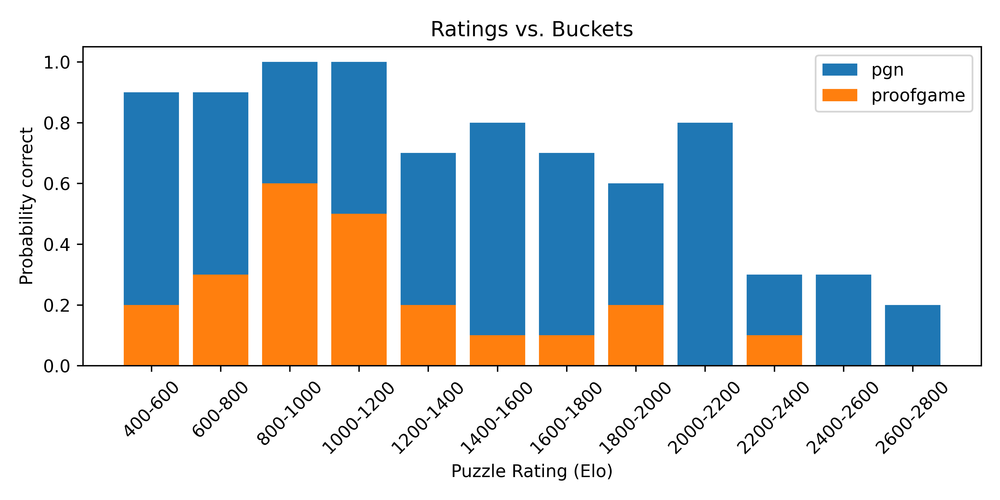

# ChessLLM robustness
This is a side project to test how sensitive LLMs that play chess are to non-semantic factors (other than the position on the board).
Currently it only supports the OpenAI text completion API,
and has only been tested on GPT-3.5-turbo-instruct.

Adapted from [Nicholas Carlini's repo](https://github.com/carlini/chess-llm) and [blogpost](https://nicholas.carlini.com/writing/2023/chess-llm.html).    


## Wait, LLMs can play chess?
LLMs that play chess (currently mostly GPT-3.5-turbo-instruct) currently take the game state as a PGN, 
and predict the next move.
For example, to respond to a Sicilian , one can prompt the model with

    [White "Garry Kasparov"]
    [Black "Magnus Carlsen"]
    [Result "1/2-1/2"]
    [WhiteElo "2800"]
    [BlackElo "2800"]
    
    1. e4 c5 2.

and if it predicts ` Nf3`, it means the engine should return the move `Nf3`.
Turns out this engine can play chess pretty well (beating the 1800-rated Stockfish handily), 
and model the board state extremely well, almost never making illegal moves.

(It helps to put strong players in the PGN header, because we can [ask for generalization](https://evjang.com/2021/10/23/generalization.html).)


## What is this?
The fact that the model does not take the current position, but rather the entire sequence of moves, as input,
has interesting implications: the model's "thinking" in a given position might vary significantly based on features beyond the current board state.

For example, what does the model play for White in the position `2rq1rk1/1p2ppbp/p1npb1p1/8/2P1P3/1PN5/P2BBPPP/2RQ1RK1 w - - 0 1` here?



Turns out, it depends on how you arrive to it.  If the moves are
```
1. e4 c5 2. Nf3 Nc6 3. d4 cxd4 4. Nxd4 g6 5. c4 Bg7 6. Be3 Nf6 7. Nc3 O-O 8. Be2 d6 9. Nf3 Ng4 10. Bd2 Qb6 11. O-O Nge5 12. Qb3 Qd8 13. Nxe5 Nxe5 14. Qc2 Be6 15. b3 Rc8 16. Rac1 a6 17. Qd1 Nc6
```
you get `Be3`; whereas if the moves are
```
1. d4 Nf6 2. c4 g6 3. Nc3 Bg7 4. e4 d6 5. Nf3 c5 6. Be2 cxd4 7. Qxd4 Nc6 8. Qd1 O-O 9. O-O Nd7 10. Bd2 Nce5 11. Nxe5 Nxe5 12. Qc2 Be6 13. b3 Rc8 14. Rac1 a6 15. Qd1 Nc6
```
you get `Nd5`.




The probabilities aren't even close. Both games are pretty natural, maybe not top-level, but not obviously bad.


## How to construct pairs of positions?
There is a tool called [proofgame](https://github.com/peterosterlund2/texel/blob/9c17c7703a94cead244e3435263ff916b178dc97/doc/proofgame.md) in the [texel](github.com/peterosterlund2/texel) repo that returns a PGN for a given FEN. 
We use the option `-f` and set the last two entires of the FEN to `0 1`, because we only care about the position, not the number of moves it took to get there.
The games it constructs are quite unnatural, and are usually a bit longer than the original game that led to the position.

As in Carlini's repo, we test the model on puzzles and report the accuracy, only here we report both the accuracy on the original game that led to a puzzle, and the accuracy on the constructed game that led to the same position.




## How to reproduce the experiment
1.  Run `generate_pgn_puzzles.py` to download a bunch of puzzles and corresponding games from Lichess.
2.  Run `pgn_to_fen.py` to get a nice file of FENs.
3.  Use `proofgame.py` to generate proof games. Depending on the size of the dataset, this is somewhat slow. 
The default and to spend 3 minutes per FEN, so it can produce PGNs for about 50\% of the FENs in a representative dataset.
However, all jobs are single-threaded and don't take much memory, so the default setting is to run 64 FENs in parallel.
4.  Run `make_pairs_puzzles_dataset.py` to generate a dataset of puzzles and their solutions.
5.  Run `puzzle_pair_solver.py` to compare how the model performs.
 
(The above is complicated because it's WIP, but it works. Eventually it should be a single script.)


## Possible next steps
- Log the model's rate of illegal moves in out-of-distribution games versus in-distribution games, keeping the position the same.
- Try other chess-playing LLMs, such as the Pythia-Chess models from EleutherAI.
- Display (position, game1, game2) ranked by how much the recommended move disagrees measuring difference in logprobs, e.g. with Jensen-Shannon distance. It could be that there are interesting patterns.
- Find another way of constructing pairs of PGNs leading to the same position, that doesn't make one of the games very unnatural. One way is to query the Lichess database for all appearances of a position, and take all different PGNs that led to this position. This will likely only work for positions before the 20th move or so.
- Test other sources of spurious features, like the exact ratings of the players in the header. In general, test how the header affects the model's predictions. Maybe it's possible to construct a header that makes the model play much better?
- Figure out what to do with these experiments? I originally wrote it as an addendum to [a paper on checking consistency in chess engines and LLMs](https://arxiv.org/abs/2306.09983), but the intersection of the two turned out not to be on-topic for that paper in particular.

## Installing

This project has minimal dependencies so far: python-chess, litellm, cachier (for caching responses, it's possible to turn it off). 

    pip install -r requirements.txt


### Texelutil
The texelutil binary (version 1.10) that works on x86-64 Ubuntu is included in this repo.
If you are on a different platform, you can get it from [here](https://github.com/peterosterlund2/texel/releases/tag/1.10).
In some cases you will need to compile it from scratch, which is easy; just follow the instructions in the `texel` repo.

### Add your OpenAI key

Put your key in a file called `OPENAI_API_KEY`.

## Are human players and other chess engines affected by the move sequence?
Humans, certainly. Players may adjust their strategies based on whether their opponent is playing well or poorly.
However, I would bet the effect is more severe in current LLMs, even when accounting for player rating: 
players of similar strength as GPT-3.5-turbo-instruct should be affected much less.

As for other engines, technically yes, but in practice not that much. Stockfish caches some previously explored states during the game, which informs its initial search each time a new move is played. Nonetheless, given sufficient time to search, it should explore a similar set of positions regardless of how it arrived at the current one.


## License: GPL v3

This program is free software: you can redistribute it and/or modify it under the terms of the GNU General Public License as published by the Free Software Foundation, version 3.

This program is distributed in the hope that it will be useful, but WITHOUT ANY WARRANTY; without even the implied warranty of MERCHANTABILITY or FITNESS FOR A PARTICULAR PURPOSE. See the GNU General Public License for more details.

You should have received a copy of the GNU General Public License along with this program. If not, see http://www.gnu.org/licenses/.


